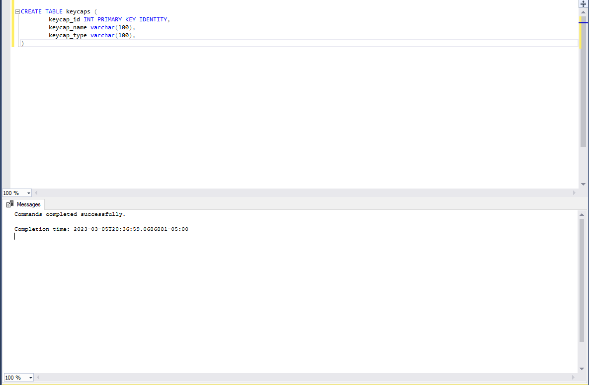

# Local keyboard project to keep track of my collection

## Technologies used and Resources

### Front end

- [ReactJS](https://reactjs.org/)
- [Typescript](https://www.typescriptlang.org/)
- [React Query](https://react-query-v3.tanstack.com/)
- [SCSS](https://sass-lang.com/documentation/syntax)
- [Material UI](https://mui.com/material-ui/)

### Back end

- [NodeJS](https://nodejs.org/en/)
- [Express](https://expressjs.com/)
- [Microsoft SQL](https://www.microsoft.com/en-ca/sql-server/sql-server-downloads)

### Other Resources

- [Postman](https://www.postman.com/)
- [nodemon](https://www.npmjs.com/package/nodemon)
- [Markdown Cheatsheet](https://github.com/adam-p/markdown-here/wiki/Markdown-Cheatsheet)

## Features

- Create Keyboard
- Delete Keyboard
- Edit Keyboard
- View Keyboard
- View Switches
- Create Switch
- Delete Switch

#### TODO

- Create Keycaps
- Delete Keycaps
- View keycaps
- Redux

## Setup

- Following this [guide](https://learn.microsoft.com/en-us/sql/database-engine/install-windows/install-sql-server?view=sql-server-ver16) to set up microsoft sql on your local machine to create your database.

- Open SQLQuery2.sql on your local machine, and run the table commands located in utils/SQLTables

- Open up your terminal and CD into the keyboard-backend folder and run the backend server on localhost:3000.

  - cd keyboard-backend
  - run the server nodemon app.js

- Open up another terminal and CD into keyboard-fe and run the front end server on localhost:3001
  - cd keyboard-fe
  - npm start

## Enjoy
